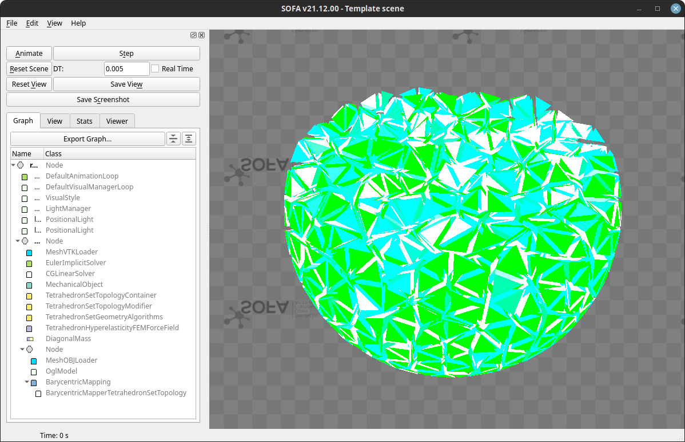

# Sofa python template




With the following env variable:
```
export SOFA_ROOT="<path-to-sofa-build>"
export SOFAPYTHON3_ROOT=$SOFA_ROOT
export PYTHONPATH="$PYTHONPATH:$SOFA_ROOT/lib/python3/site-packages
```

### Launcher

Create a study case by providing the output path, the default parameters and a tree file (for files context).
Link the scene graph and run the SOFA simulation.

```python
from template.utils import Params, Model
from template.meshing import create_data
from template.scene import create_graph


def main():
    out = tf.f(__file__) / "out"
    params = Params.from_file(
        simu_path=out,
        yaml_path=out.p / "params.yaml",
        tree_path=out.p / "main.tree",
    )

    model = Model(create_graph, params)
    create_data(model)
    model.run(gui=True, title="Template scene")
```

### Scene factory

Define the SOFA components in a factory to reuse them in the scene.

```python
from template.utils import Params, NodeHelper as Nh, BaseFactory, VisualStyle

class Factory(BaseFactory):
    def HEADER(self, *v):
        return (
            self.DefaultAnimationLoop(),
            self.DefaultVisualManagerLoop(),
            self.VisualStyle(displayFlags=" ".join(v)),
        )
    
def create_graph(root: Node, params: Params):
    fa = Factory()
    fa.cfg = lambda x: params[x].value

    Nh(root).add(*fa.HEADER(VisualStyle.showForceFields))
```

### Parameters in `params.yaml`

High-level object to deal with parameters.

```
GENERAL:
  simu_path: ~
  dt: 5e-3
PHYSICS:
  material:
    mat_name: MooneyRivlin
```

### Files and folders in `main.tree`
Define a folder named `data` that contains 2 files.
`data.abs()` returns the folder absolute path, `data.mesh_tetra` returns the equivalent of
`data.abs()/mesh.vtk`.
```
. data
    - mesh_tetra: mesh.vtk
    - mesh_visu: mesh.obj
```
Files defined in a tree file are automatically added to the parameters instance.